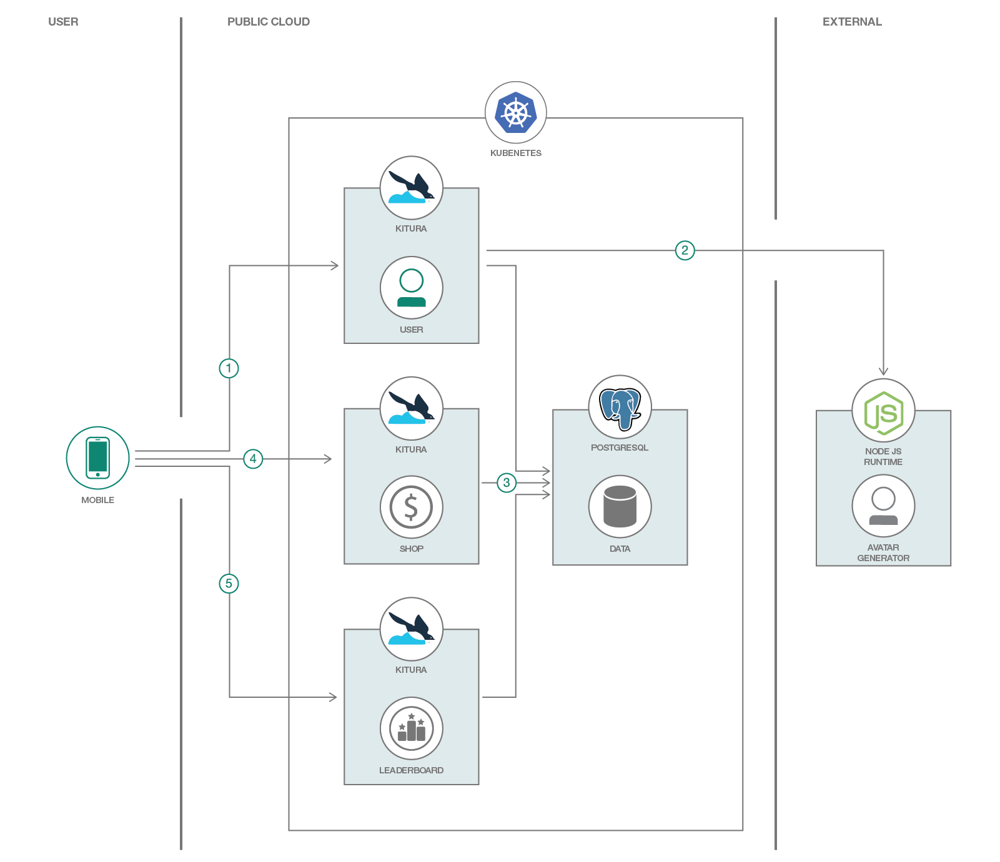
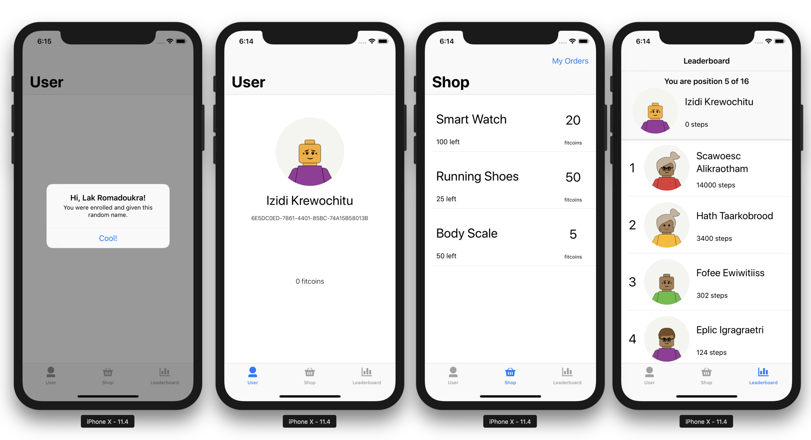
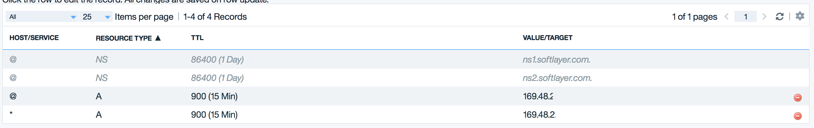

[](https://travis-ci.com/IBM/kitura-on-kubernetes)
# Use Full-Stack Swift to develop iOS apps with Kitura in Kubernetes

In this code pattern, we will create a simple step tracker iOS app written in Swift. The application's backend will also be written in Swift with the use of Kitura, a server-side web framework for Swift. This code pattern is for iOS developers who wish to write both their frontend and backend in one language. Working in one language helps developers concentrate and spend more time in the logic of their application rather than learning or dealing with another programming language. The 3 simple Kitura microservices will be deployed in Kubernetes, a container orchestration platform. The sample iOS app is a simple step tracker that rewards users with "fitcoins".

When you have completed this code pattern, you will understand how to:

* Build a server-side Swift application with Kitura
* Use Kitura with Swift Kuery to connect to a Database
* Deploy Kitura microservices in Kubernetes
* Integrate an iOS app with the Kitura backend
* Make Kubernetes available under a public domain with TLS

## Flow



1. The first time the iOS app opens, it would try to register through the Users microservice.
2. The Users microservice communicates with an external service for its avatar assignment to the user.
3. The Users microservice then persists the user info in the database. The Users microservice would also update the steps of the users and award them "fitcoins".
4. The Leaderboard microservice provides a way to give the users standings with their steps count based on the stored data in the database.
5. The Shop microservice will get the products from the database where users can exchange them with their "fitcoins". This is also where the APIs for creating the transactions on updating the "fitcoins" of the users.

## Included Components

* [IBM Cloud Kubernetes Service](https://console.bluemix.net/docs/containers/container_index.html): IBM Bluemix Container Service manages highly available apps inside Docker containers and Kubernetes clusters on the IBM Cloud.
* [Kitura](https://www.kitura.io/): Kitura is a free and open-source web framework written in Swift, developed by IBM and licensed under Apache 2.0. It’s an HTTP server and web framework for writing Swift server applications.
* [PostgreSQL](https://www.postgresql.org/): Sophisticated open-source Object-Relational DBMS supporting almost all SQL constructs.

## Featured Technologies

* [Container Orchestration](https://www.ibm.com/cloud/container-service): Automating the deployment, scaling and management of containerized applications.
* [Databases](https://en.wikipedia.org/wiki/IBM_Information_Management_System#.22Full_Function.22_databases): Repository for storing and managing collections of data.
* [Microservices](https://www.ibm.com/developerworks/community/blogs/5things/entry/5_things_to_know_about_microservices?lang=en): Collection of fine-grained, loosely coupled services using a lightweight protocol to provide building blocks in modern application composition in the cloud.
* [Mobile](https://mobilefirstplatform.ibmcloud.com/): Systems of engagement are increasingly using mobile technology as the platform for delivery.
* [Swift on the Server](https://developer.ibm.com/swift/): Build powerful, fast and secure server side Swift apps for the Cloud

# Prerequisites

* Create a _Standard_ Kubernetes cluster with [IBM Bluemix Kubernetes Service](https://console.bluemix.net/docs/containers/cs_cli_install.html#cs_cli_install) to deploy in cloud. The code here is regularly tested against [Kubernetes Cluster from IBM Cloud Kubernetes Service](https://console.ng.bluemix.net/docs/containers/cs_ov.html#cs_ov) using Travis.

* [Helm](https://helm.sh/) package manager. Helm will be needed to install [cert-manager](https://github.com/jetstack/cert-manager) for issuing certificates from _Let's Encrypt_. You can install Helm by going to through their [official documentation](https://github.com/kubernetes/helm/blob/master/docs/install.md).

* [Xcode](https://developer.apple.com/xcode/) is needed for developing iOS apps.

* Install [Docker](https://www.docker.com) by following the instructions [here](https://www.docker.com/community-edition#/download) for your preferred operating system. You would need docker if you want to build and use your own images. You would need to have a [Docker Hub](https://hub.docker.com/) account to push your images.

# Steps

### 1. Clone the repo
```
$ git clone https://github.com/IBM/<this-repo-name>
```

### 2. Create IBM Cloud Kubernetes Service

Create an IBM Cloud Kubernetes Service if you don't already have one:

* [IBM Cloud Kubernetes Service](https://console.bluemix.net/containers-kubernetes/catalog/cluster)

### 3. Create and Deploy Kitura Microservices

* The Kitura applications are already built. Their source code is in their respective folders in `containers` folder. You can open the Xcode project file to open it in Xcode.

```
$ export DOCKERHUB_USERNAME=<your-dockerhub-username>

$ docker build -t $DOCKERHUB_USERNAME/kitura-users:latest containers/users/
$ docker build -t $DOCKERHUB_USERNAME/kitura-shop:latest containers/shop/
$ docker build -t $DOCKERHUB_USERNAME/kitura-leaderboards:latest containers/leaderboards/

$ docker push $DOCKERHUB_USERNAME/kitura-users:latest
$ docker push $DOCKERHUB_USERNAME/kitura-shop:latest
$ docker push $DOCKERHUB_USERNAME/kitura-leaderboards:latest
```

* Edit these Kubernetes manifests files in `manifests` folder to use your own images
  * leaderboard.yaml
  * shop.yaml
  * users.yaml

```
e.g. manifests/leaderboard.yaml
...
    image: anthonyamanse/kitura-leaderboard:1.0
    ## change the value to the images you just built in the previous step.
...
```

* You'll need to deploy a simple Postgres container in your cluster.
> This is only for testing (data will be deleted if container is destroyed/restarted). You'll need to setup your own persistency or you can use [Compose for PostgreSQL](https://www.ibm.com/cloud/compose/postgresql) for production.

```
## Create the credentials and deploy PostgreSQL
$ kubectl create cm postgres-cm --from-env-file=postgres-config.env
$ kubectl apply -f manifests/postgres.yaml

## Make sure the postgres container is running
$ kubectl get pods
```

* You can now deploy the Kitura microservices

```
$ kubectl apply -f manifests/leaderboard.yaml
$ kubectl apply -f manifests/shop.yaml
$ kubectl apply -f manifests/users.yaml

## Make sure the 3 of them are running
$ kubectl get pods
```

### 4. Expose with Kubernetes Ingress

* You would want to expose the backend you deployed so that the iOS app can communicate with it. With Kubernetes Ingress, this would allow you to expose these microservices. You can use the provided Ingress Subdomain that came with the IBM Cloud Kubernetes Service.

```
$ bx cs cluster-get <Your cluster name here>

## You should look for these values
## ..
## Ingress Subdomain:	anthony-dev.us-south.containers.mybluemix.net
## Ingress Secret:		anthony-dev
## ..
```

* Modify `manifests/ingress.yaml` to use the provided subdomain you have

```
...
spec:
  tls:
  - hosts:
    - YOUR_INGRESS_SUBDOMAIN
    secretName: YOUR_INGRESS_SECRET
  backend:
    serviceName: users
    servicePort: 8080
  rules:
  - host: YOUR_INGRESS_SUBDOMAIN
...
```

> If you want to use your own domain, proceed to step #6

* Apply the Kubernetes Ingress resource

```
$ kubectl apply -f ingress-prod.yaml
```

* Test the Kitura routes to make sure they are running properly

```
$ export URL=https://YOUR_INGRESS_SUBDOMAIN

## Create a user
$ curl -X POST -H 'Content-type: application/json' -d "$(curl $URL/users/generate)" $URL/users

{"name":"Gisk Igofrow","userId":"6A213D99-7C08-4BF2-A250-D24E3310236B","stepsConvertedToFitcoin":0,"image":"..." ...}

## Get the users
$ curl $URL/users

[{"name":"Gisk Igofrow","userId":"6A213D99-7C08-4BF2-A250-D24E3310236B" ...}]

## Create products
curl -X POST -H 'Content-type: application/json' -d "$(cat sampleProducts/smartwatch.json)" $URL/shop/products
curl -X POST -H 'Content-type: application/json' -d "$(cat sampleProducts/runningshoes.json)" $URL/shop/products
curl -X POST -H 'Content-type: application/json' -d "$(cat sampleProducts/smartbodyscale.json)" $URL/shop/products

## Get the products
$ curl $URL/shop/products

[{"productId":"smartwatch","price":20,"quantity":100,"name":"Smart Watch"},{"productId":"shoes","price":50,"quantity":25,"name":"Running Shoes"},{"productId":"bodyScale","price":5,"quantity":50,"name":"Body Scale"}]
```

### 5. Configure the iOS app

Open the Xcode project `iOS/KituraStepTracker/KituraStepTracker.xcworkspace`

* Modify the lines in the files in `Controllers` folder and `AppDelegate.swift` that says

```
let KituraBackendUrl = "https://anthony-dev.us-south.containers.mybluemix.net"

## Change the variable to point to your own backend
## let KituraBackendUrl = "https://YOUR_INGRESS_SUBDOMAIN"
```

* You can now build and run it in a simulator. The app should now be connected to your Kitura microservices in Kubernetes.
> To test the step tracking part of the app, you would need a physical device with a pedometer (iPhone 5s+).



### 6. Use your own domain name and manage certificate with Let's Encrypt

To enable TLS in your own domain, you may want to automate issuance of the TLS certificates. You can do this with `cert-manager` to request certificates from Let's Encrypt.

* Go to your domain registrar and create an _**A record**_ for your domain to point to the IP address of your Kubernetes ingress. You can get the IP address of your ingress by doing:



```
$ kubectl get ing

## NAME      HOSTS                  ADDRESS          PORTS     AGE
## ingress   www.ibm-fitchain.com   169.48.XYZ.XYZ   80, 443   2d
```

* You would need to first initialize `helm`. This will install `tiller` in your cluster.

```
$ helm init
```

* You can now install `cert-manager`

```
$ helm install \
    --name cert-manager \
    --namespace kube-system \
    stable/cert-manager
```

* Modify `cert-manager/issuer.yaml` to use your own valid email address.
  > More details [here](https://cert-manager.readthedocs.io/en/latest/tutorials/acme/http-validation.html)

```
...
email: EMAIL_ADDRESS
## change it to a valid one
...
```

* Deploy the issuer resource

```
$ kubectl apply -f cert-manager/issuer.yaml
```

* Modify `cert-manager/certificate.yaml`

```
...
spec:

  ## THIS WILL PRODUCE A CERTIFICATE NAMED ibm-fitchain-com-tls
  secretName: ibm-fitchain-com-tls
  issuerRef:
    name: letsencrypt-prod

  ## PROVIDE YOUR OWN DOMAIN NAME
  commonName: www.ibm-fitchain.com
  dnsNames:
  - www.ibm-fitchain.com
  acme:
    config:
    - http01:
        ingressClass: nginx
      domains:

      ## PROVIDE YOUR OWN DOMAIN NAME
      - www.ibm-fitchain.com
    - http01:
        ingress: my-ingress
      domains:

      ## PROVIDE YOUR OWN DOMAIN NAME
      - www.ibm-fitchain.com
```

* Deploy the certificate resource

```
$ kubectl apply -f cert-manager/certificate.yaml

## Wait for the certificate to get issued
$ kubectl describe certificate
```

* Once successful, you can check in your browser if your domain is working properly. If it has proper certificates, you should be able to see a Kitura starting page without security warning from your browser. _(You'll also see a lockpad icon beside your domain name)_

# Links

* [Kitura](https://www.kitura.io/): A powerful server-side Swift web framework.
* [Swift-Kuery-ORM](https://github.com/IBM-Swift/Swift-Kuery-ORM): An ORM (Object Relational Mapping) library built for Swift. Using it allows you to simplify persistence of model objects with your server.
* [cert-manager](https://cert-manager.readthedocs.io/en/latest/index.html): A native Kubernetes certificate management controller. It can help with issuing certificates from a variety of sources, such as Let’s Encrypt, HashiCorp Vault or a simple signing keypair.
* [Deploy a Core ML model with Watson Visual Recognition](https://developer.ibm.com/code/patterns/deploy-a-core-ml-model-with-watson-visual-recognition): code pattern shows you how to create a Core ML model using Watson Visual Recognition, which is then deployed into an iOS application.

# Learn more

* **Kubernetes on IBM Cloud**: Deploy and manage your containers in [Kubernetes on IBM Cloud](https://www.ibm.com/cloud/container-service).
* **Microservices and Container Orchestration**:
Interested in microservices applications? Check out our other [Microservices Code Patterns](https://developer.ibm.com/code/technologies/microservices/) and [Container Orchestration Code Patterns](https://developer.ibm.com/code/technologies/container-orchestration/).


# License
[Apache 2.0](LICENSE)
